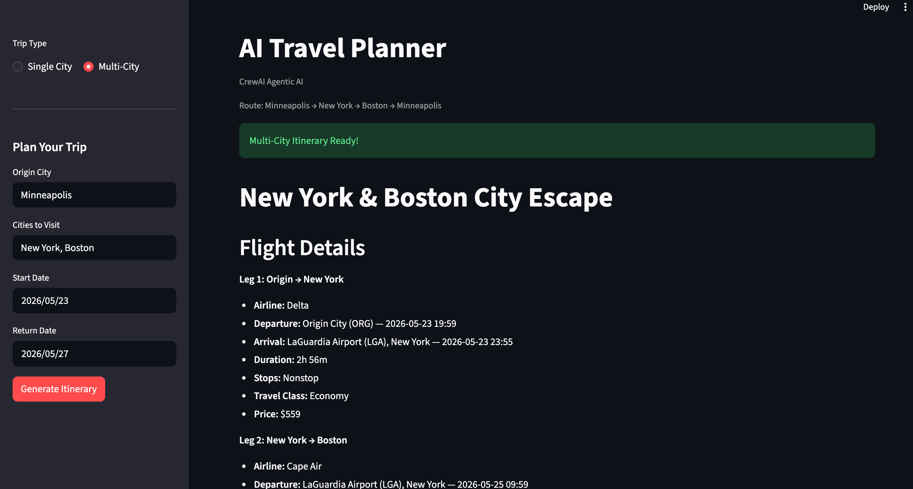

# Multi-Agent AI Travel Planner

A multi-agent travel planning system built with CrewAI, FastAPI, and Streamlit. Given a departure city, destination(s), and travel dates, it searches real flight and hotel data via SerpAPI and uses a pipeline of LLM agents to recommend the best options and generate a detailed day-by-day itinerary.



---

## Features

- **Single-city planning** — origin, destination, check-in/check-out dates → full itinerary
- **Multi-city planning** — departure city, list of cities, date range → agent-decided visit order and day allocation → full multi-city itinerary
- **Parallel agent execution** — flights and hotel agents run simultaneously to minimise latency
- **Real data** — live flight and hotel results via SerpAPI Google Flights and Google Hotels
- **Airport resolution** — city names resolved to IATA codes automatically

---

## Architecture

### Single-City Flow (3 LLM calls)

```
User Request
     │
     ├── search_flights() ──┐  (parallel)
     └── search_hotels()  ──┤
                            │
                     flights_agent ──┐  (parallel)
                     hotels_agent  ──┤
                                     │
                             itinerary_agent
                                     │
                               Final Itinerary
```

### Multi-City Flow (N + 3 LLM calls, where N = number of cities)

```
User Request
(origin, cities, start_date, return_date)
     │
     ▼
allocation_agent         ← decides visit order + days per city
     │
compute_legs()           ← resolves airports, computes dates per city (no LLM)
     │
     ├── search_multi_city_flights()  ──┐
     ├── search_hotels(city_1)        ──┤  (all parallel)
     ├── search_hotels(city_2)        ──┤
     └── search_hotels(city_N)        ──┘
                                        │
                        flights_agent             ──┐
                        hotels_agent (city_1)     ──┤  (all parallel)
                        hotels_agent (city_2)     ──┤
                        hotels_agent (city_N)     ──┘
                                        │
                                itinerary_agent
                                        │
                                Final Itinerary
```

**Latency** = t(allocation) + max(t(flights), t(hotel_1..N)) + t(itinerary)

Hotel agents never slow each other down — all N run in parallel.

---

## Agents

| Agent | Task | Model |
|-------|------|-------|
| `allocation_agent` | Decides optimal visit order and days per city based on tourism density and geography | Gemini Flash |
| `flights_agent` | Picks the best flight option by price, duration, stops, and travel class | Gemini Flash |
| `hotels_agent` | Picks the best hotel per city by price, rating, location, and amenities | Gemini Flash |
| `itinerary_agent` | Generates a full day-by-day itinerary in markdown | Gemini Flash |

Each agent runs in its own isolated CrewAI `Crew` (one agent, one task). This is what enables true parallelism via `asyncio.to_thread`.

---

## Project Structure

```
multi-agent-travel-planner/
├── src/
│   ├── main.py          # FastAPI app, endpoints, compute_legs()
│   ├── agent_crew.py    # Agent/Task/Crew setup, allocate_days(), run(), run_multi_city()
│   ├── search.py        # SerpAPI wrappers, airport resolution, formatters
│   └── models.py        # Pydantic models
├── config/
│   ├── agents.yaml      # Agent roles, goals, backstories
│   └── tasks.yaml       # Task descriptions and expected outputs
├── frontend/
│   └── app.py           # Streamlit UI (single-city + multi-city tabs)
└── requirements.txt
```

---

## API Endpoints

### `POST /plan`
Single-city trip planner.

**Request:**
```json
{
  "origin_city": "New York",
  "destination_city": "Los Angeles",
  "check_in_date": "2026-06-01",
  "check_out_date": "2026-06-07"
}
```

**Response:**
```json
{
  "itinerary": "# Trip to Los Angeles\n..."
}
```

---

### `POST /plan/multi-city`
Multi-city trip planner. The allocation agent decides the visit order and days per city — the user only provides the list of cities and the overall date range.

**Request:**
```json
{
  "origin_city": "Boston",
  "cities": ["Paris", "Rome", "Barcelona"],
  "start_date": "2026-06-01",
  "return_date": "2026-06-13"
}
```

**Response:**
```json
{
  "itinerary": "# Multi-City Europe Trip\n..."
}
```

---

## Setup

### 1. Clone and install dependencies

```bash
git clone https://github.com/Prajwal-u2/multi-agent-travel-planner.git
cd multi-agent-travel-planner
pip install -r requirements.txt
```

### 2. Set environment variables

Create a `.env` file in the project root:

```env
SERP_API_KEY=your_serpapi_key
GOOGLE_API_KEY=your_google_ai_key
```

- **SERP_API_KEY** — from [serpapi.com](https://serpapi.com)
- **GOOGLE_API_KEY** — from [Google AI Studio](https://aistudio.google.com)

### 3. Start the backend

```bash
cd src
python main.py
```

Backend runs at `http://localhost:8000`. API docs at `http://localhost:8000/docs`.

### 4. Start the frontend

```bash
streamlit run frontend/app.py
```

---

## Tech Stack

| Layer | Technology |
|-------|-----------|
| Backend | FastAPI + Uvicorn |
| Agents | CrewAI |
| LLM | Gemini 2.5 Flash Lite (via Google AI) |
| Flight & Hotel Data | SerpAPI (Google Flights + Google Hotels) |
| Airport Resolution | `airportsdata` |
| Frontend | Streamlit |
| Data validation | Pydantic |
